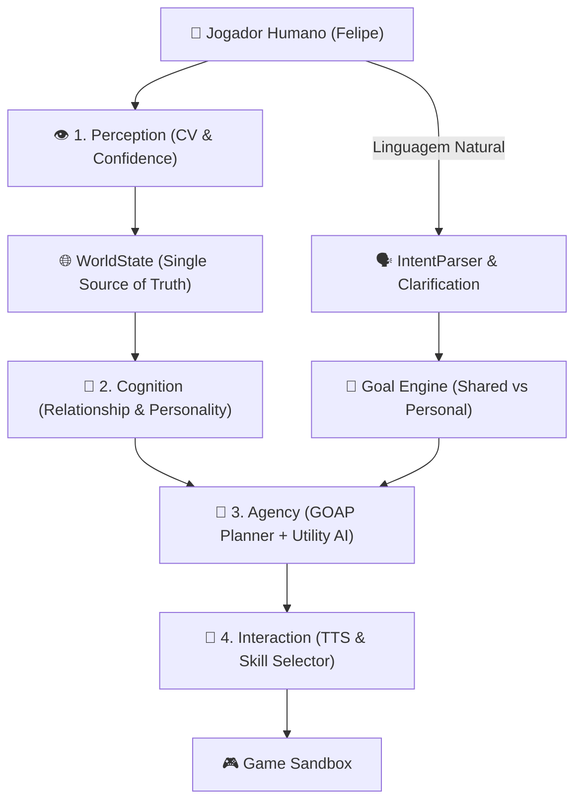

# Klayton Companion Agent 2.0 - Autonomous Multimodal Companion Agent 🤖🤝

[](https://www.python.org/)
[](https://opencv.org/)
[](https://github.com/tesseract-ocr/tesseract)
[]()
[](LICENSE)

**Klayton Companion Agent 2.0** é um **Framework de Agente Autônomo e Social de Segunda Pessoa (Companion Agent)**. Em vez de uma automação baseada em macros imperativos, o Klayton opera como um segundo jogador virtual dotado de personalidade, consciência social, raciocínio orientado a objetivos (GOAP + Utility AI), comunicação por voz (TTS) e atenção compartilhada.

> **Disclaimer:** Este projeto é desenvolvido estritamente para **pesquisa em Inteligência Artificial, visão computacional e agentes autônomos sociais**.

---

## 🎯 Visão Geral da Arquitetura

O Klayton evoluiu de uma Finite State Machine engessada para uma **Arquitetura Cognitiva em 4 Pilares**:

1. **Perception Layer (Visão Computacional & Confiança)**: Captura de tela ultra-rápida via `mss`, `OpenCV` e `Tesseract OCR` produzindo observações com índice de confiança (`Observation.confidence >= 0.50`).
2. **Cognition & Social Model**: Modelo unificado do mundo (`WorldState`), Barramento de Eventos Pub/Sub (`EventBus`), Contexto de Relacionamento (`RelationshipState`), Matriz de Personalidade (`Personality`) e Atenção Compartilhada (`SharedAttention`).
3. **Agency & Goal Engine (GOAP + Utility AI)**: Motor de utilidade (`utility = reward - risk - cost - time`) e planejador GOAP com suporte a **REPLAN** automático e conciliação de metas compartilhadas vs. pessoais.
4. **Interaction & Dialogue ("Thought ➔ Action ➔ Speech")**: Gerenciador de diálogo com voz (TTS) que expressa publicamente intenções (*"Minha equipe está meio machucada. Vou no Pokémon Center e já volto!"*) e motor de perguntas de esclarecimento.

---

## ✨ Recursos Principais

### 🧠 Agente Companheiro & Presença Social
* **Matriz de Personalidade**: Ajusta dinamicamente a utilidade de exploração, curiosidade, tolerância ao risco e independência.
* **Memória de Relacionamento**: Rastreia distância do líder, direção e instruções sociais como *"Klayton, me espera aqui"*.
* **Comunicação por Voz & TTS**: Expressão verbal pública de decisões internas (*Thought ➔ Action ➔ Speech*).
* **Atenção Compartilhada (`SharedAttention`)**: Resolução contextual de comandos como *"Pega esse"* cruzando visão do cursor e oponentes.

### 🛡️ Fortalecimento Técnico & Prevenção de Loops
* **Agent Watchdog**: Supervisão em tempo real anti-loop e anti-travamento.
* **Navegação por Grafo de Mapas & A***: Roteamento global de longa distância e verificação de movimento (*"Nunca assuma que a ação funcionou; verifique no frame seguinte"*).
* **Replay Logger**: Gravador de sessões em formato `.jsonl` para inspeção e depuração de decisões de IA.

---

## 🏗️ Diagrama do Agente



---

## 🚀 Getting Started

### Prerequisites

* **Operating System**: Windows 10/11 (Required for native input & alert subsystems).
* **Python**: `3.10` or higher.
* **Tesseract OCR Engine**:
  * Download and install Tesseract OCR from [UB-Mannheim/tesseract/wiki](https://github.com/UB-Mannheim/tesseract/wiki).
  * Ensure the executable path matches your configuration (Default: `C:\Program Files\Tesseract-OCR\tesseract.exe`).

### Installation

1. **Clone the repository**:
   ```bash
   git clone https://github.com/Fesisp/PokeBot.git
   cd PokeBot
   ```

2. **Set up a Virtual Environment**:
   ```bash
   python -m venv venv
   # Windows PowerShell
   .\venv\Scripts\Activate.ps1
   ```

3. **Install Dependencies**:
   ```bash
   pip install -r requirements.txt
   ```

4. **Configuration Verification**:
   Edit `config/settings.yaml` to ensure your Tesseract OCR path and screen coordinates match your target client.

---

## 🎮 Usage

### Launching the Agent

1. Open the target game client and ensure it is unobstructed on screen.
2. Run the main entry point:
   ```bash
   python run_bot.py
   ```

### Hotkey Mapping (Real-Time Control)

| Key | Mode / Action | Description |
| :---: | :--- | :--- |
| `F1` | **IDLE Mode** | Passive screen scanning (alerts on target detection) |
| `F2` | **MISSION Mode** | Autonomous navigation and quest interactions |
| `F3` | **HUNTING Mode** | Targeted entity hunting & selective retreat |
| `F4` | **FOLLOW Mode** | Shadows primary lead character |
| `F5` | **Pause** | Temporarily halts execution |
| `F6` | **Resume** | Resumes agent operations |
| `F9` | **Stop** | Gracefully shuts down agent thread |

---

## 📂 Project Structure

```text
PokeBot/
├── assets/           # Template images for visual matching
├── config/           # System settings & mode configurations (YAML)
├── data/             # Game knowledge bases (Move sets, type matrices)
├── docs/             # Technical guides and architecture details
├── src/
│   ├── action/       # Humanized mouse/keyboard execution engine
│   ├── core/         # Main loop, thread manager, state orchestrator
│   ├── decision/     # Tactical engine, damage predictor & AI inference
│   ├── knowledge/    # Game knowledge managers
│   ├── perception/   # OpenCV vision processing & OCR wrappers
│   └── utils/        # Logger and auxiliary utilities
├── tests/            # Test suite
└── run_bot.py        # Primary application entry point
```

---

## 📄 License

Distributed under the **MIT License**. See `LICENSE` for details.
